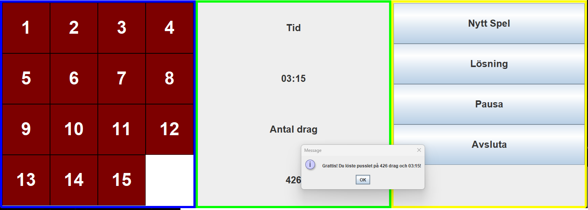

# Pussel spel

Här är ett enkelt interaktivt 15-pussel spel som går ut på att flytta brickor
till det tomma fältet
Allt är skrivet i Java och använder Swing

## Beskrivning
Du flyttar brickorna med antingen musen eller pilknapparna på tangentbordet

## Funktioner
- Spela 15-pussel med grafiskt gränssnitt
- Tidsmätning som startar vid första draget
- Räknare för antal drag
- Möjlighet att starta om spelet

## Installation
1. Se till att du har Java installerat (Java 11 eller senare)
2. Klona detta repository:
   ```bash
   git clone https://github.com/GreatGenius3/UppgiftPuzzle.git

## Spelvyn

